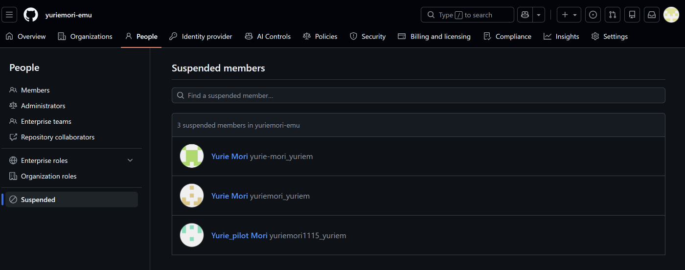
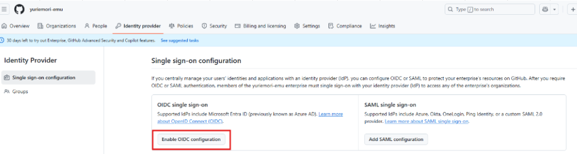
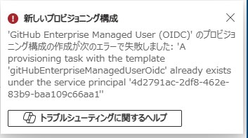
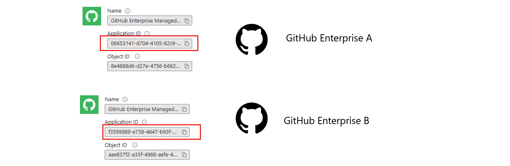

# 管理者向けGitHub Enterpriseの運用Tips紹介: 人にもAIにも優しいプラットフォームづくり

yuriemori

---

# お品書き
- GitHub EnterpriseのあるあるQ&A
- GitHub EnterpriseでのAgent/AIの管理

---
# Yurie Mori（森　友梨映）
## Job: 
- Software Solution Engineer@Microsoft Japan

## Skills/Interests:
- GitHub/Azure DevOps/Defender for Cloud/Azure PaaS
- DevOps/DevSecOps/IaC/Platform Engineering

---

# Please follow me
X（旧Twitter）とLinkedInで発信しています。ぜひフォローしてください！

---
# GitHub EnterpriseのあるあるQ&A
---
# Organizationは単一？複数？どちらにすべき？(1/2)
- Organizationを分けた方がいいかどうかは組織内でリポジトリ/ユーザーに対して適用したいガバナンスを特定のグループで分ける必要があるかどうかに依存する。
- Organizationでのレイヤーでは配下のリポジトリ、ユーザーに対する権限を制御することができるので、ユーザーのグループやリポジトリ群に対して同じガバナンスを適用するのであれば、Organizationを分けてるメリットはあまりない。（まったく同じ設定のOrganizationが複数存在することになるため）
---
# Organizationは単一？複数？どちらにすべき？(2/2)
- Organizationを分けるメリットは、例えば部署ごとにOrganizationを分けることで、部署ごとに異なるガバナンスを適用できることや、部署ごとに管理者を設定できることなどがある。
- なので、適用させたいガバナンスの違いごとにOrganizationを分けるのが望ましい。
- 部署ごとなど、単純にユーザーを論理的にグルーピングするのであれば、Organizationを分けるのではなくTeamを活用するのが望ましい。
- 昔はOrganizationは複数作らないほうがいいというプラクティスも紹介されていたけども、現在ではその記述はなくなっている。
- 参考：[組織のベストプラクティス](https://docs.github.com/ja/enterprise-cloud@latest/organizations/collaborating-with-groups-in-organizations/best-practices-for-organizations)

---
# Organizationで特定のユーザーグループごとに権限を制御したい

- Teamを活用することで特定のユーザーを論理的にグルーピングして、特定のリポジトリに対する権限を定義したり、Team単位でCopilotのライセンス付与や権限の制御ができる。
- 入れ子にすることもできる（が、階層が深くなると管理が大変になるので注意）。

  

    
Team A

    
userA-1 userA-2 user...

    

      

        Repository A-1write
      

      

        Repository A-2write
      

      

        Repository A-3write
      

    

  

  

    
Team B

    
userB-1 userB-2 user...

    

      

        Repository B-1write
      

      

        Repository B-2write
      

      

        Repository B-3write
      

    

  

---
# GitHub Enterprise - IdP連携を解除するとどうなる？
<!-- _class: tinytext -->
- Setpユーザー以外はユーザーは休眠ユーザーとして残る（PeopleのSuspendedで確認できる）。
- 休眠中のユーザーはGitHub Enterpriseにログインできない。
- IdP連携を再度有効化すれば、休眠ユーザーは復活する。

---
# EMUの環境を使っている。連携しているIdPの変更はできる？
<!-- _class: tinytext -->
- 最初はEntra IDで連携していたけど、途中でOktaなどの他のIdPに変更することはできるのか？
- Yes。
→ 参考：[新しい ID プロバイダーまたはテナントへの Enterprise の移行](https://docs.github.com/ja/enterprise-cloud@latest/admin/managing-iam/reconfiguring-iam-for-enterprise-managed-users/migrating-your-enterprise-to-a-new-identity-provider-or-tenant)
- 移行の際に既存のIdPの連携を切るときは、IdPの連携を停止するとSetupユーザー以外のすべてのユーザーが休眠ユーザーとなりアクセスできなくなるので、連携IdPを切る前にSetupユーザーが作業ができるように（＝IdPに依存する認証なしでGitHub Enterpriseにアクセスできるように）しておく。
- 再びIdPと連携する際、usernameは移行元・移行先で一致するようにする必要がある。
- 最も安全なのはusernameに全く同じ値を設定していることだけど、正規化されてもこの値が移行先/移行元で完全に変わる場合（yuriemori@XXX.com→yuriemori@XXX.corp.com, yuriemori@XXX.com→yuriemori_new@XXX.comのように）は新しいEnterpriseアカウントのプロビジョニングが必要となる。
---
# 複数のEnterpriseを運用する際の注意点
---
# Enterpriseはいくつまで作れる？
- 4つまで。同じGitHubアカウントでEnterprise ownerになっている環境が4つある状態でEnterpriseを作成しようとすると、上限に達しているというメッセージが出てくる👇

- この「4つ」はNon-EMUの環境もEMUの環境も両方含めた数。
--- 
# EMUとNon-EMU, データレジデンシー版の併存はできる？
- 現在提供されているのは、個人GitHubアカウントで利用を開始するGitHub Enteprise Cloudと、Entra IDなどのIdPでユーザーアカウントをプロビジョニングするEnterprise Managed Users（EMU）版、さらにEMUの場合、日本国内にデータをホスティングするデータレジデンシー版の3つのオプションがある。
- これらの環境の併存はできる。だが、IdPの連携において、**同一Entraのテナント内で、OIDC認証によるSSOの設定は1つのGitHub Enteprise環境でのみ可能**。
---
# GitHub Enterprise CloudとIdP連携
- GitHub Enterprise Cloud - Microsoft Entra IDの連携：
  - Non-EMU（個人アカウント許容）: SAML認証のみ対応
  - EMU（企業用アカウントで運用）：OIDC, SAML認証に対応
- Enable OIDCのボタンを押してEntraに認証することでEntra IDにOIDC連携用のエンタープライズアプリケーションが登録される。

---
# OIDC連携ができるのは1つのEnterprise環境のみ
- OIDC連携設定時に登録されるエンタープライズアプリケーションは、同一Entraテナント内の1つのみ。
- そのため、すでにOIDC連携が完了しているGitHub Enterpriseがある状態で、2つ目のEMUの環境を作ってOIDCの連携をしようとすると、すでにエンタープライズアプリケーションがあるのでエラーになってしまう。

---
# SAML認証は複数の設定が可能
- SAML認証の場合は、SAML連携用のエンタープライズアプリケーションを複数同一テナント内に作ることができるため、併存させることは可能。
- OIDC連携をしているGitHub Enterprise + SAML連携をしているGitHub Enterprise→⭕
- SAML連携をしているGitHub Enterprise + SAML連携をしているGitHub Enterprise→⭕
- OIDC連携をしているGitHub Enterprise + OIDC連携をしているGitHub Enterprise→❌
---
# SAML認証で併存させる場合の注意点
- SAML連携用のエンタープライズアプリケーションはそれぞれ別なので、どのGitHub Enterpriseはどのエンタープライズアプリケーションと連携しているのかを管理する必要がある。

---
# GitHub Enterpriseにおけるコンテキストエンジニアリング
---
# Context Engineering
- AIシステムの周辺に包括的な情報環境を設計することに焦点を当てて、出力を生成する前ににAIエージェントがすべての関連する背景知識、メモリ、ツールにアクセスできるようにし、拡張ワークフロー全体を通じて情報を動的に管理
- コードベース、ドキュメント、MCPサーバーによりAIエージェントがアクセスできるようにすることで、AIエージェントがより正確で関連性の高い応答を生成できるようにする。
- GitHub EnterpriseのリポジトリやドキュメントをAIエージェントがアクセスできるようにすることで、AIエージェントがコードの変更点やドキュメントの内容を理解して、より適切な応答を生成できるようになる。
---
# GitHub EnterpriseでのAgent/AIの管理
## Enterprise層
- AI Control: 
Copilotの集中制御を行う。監査ログ、Aアクセスさせないデータの指定、使用可能なLLMやMSPサーバーの指定、使用可能な機能の制御

## Organization層
- Models
- Content Exclusion
- Custom Instuctions
- agent.md
---